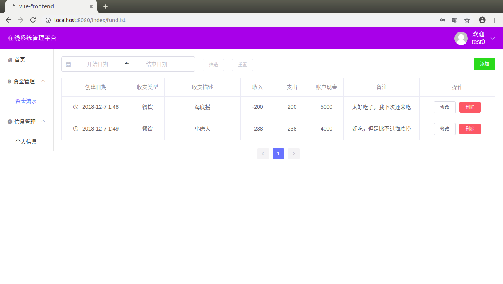

# 你 好

## 介绍

这是一个使用vuecli 3.x编写的一个资金管理系统(SPA), 后端使用nodejs提供数据接口。
后端地址：点我跳转

## 使用技术栈

1. vue3.x 前端框架
2. vuex 状态管理
3. vue-resource http请求
4. vue-router 路由管理
5. element-ui 前段ui框架
6. 其他前端必备技术

## 实现功能

核心功能：
1. 登录、注册、数据管理页面
2. 对数据的增、删、改、查功能，并在前端展示(性能提升的处理方法)
3. 实现根据时间进行筛选
4. 处理token
5. 拦截请求和响应
6. 上一页、下一页功能

## 截图



更多图片：
1. 下载体验
2. 在`./reademe`下面还有几张

## 使用方法

1. 安装依赖
```
npm install
```
2. 启动前端服务器

```
npm run serve
```
提示：需要启动后台服务器才能进入系统，后端启动方法及地址，见文首。

